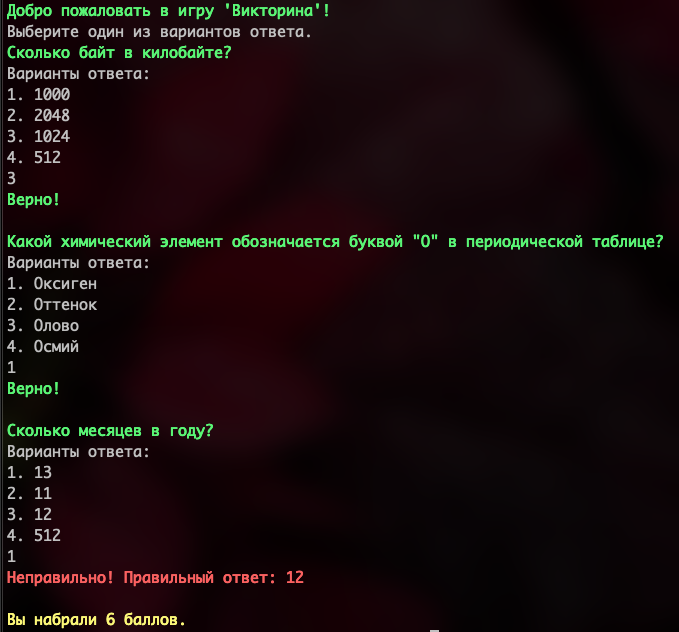

## Quiz from XML file
Each question has 4 answer choices. Choose one and score the maximum number of points.

## Installation
1. Clone the repository.
2. Install dependencies: `bundle install`
3. Run the application: `ruby main.rb`

### Quiz example:

